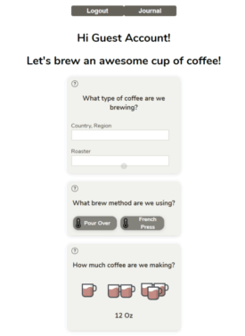
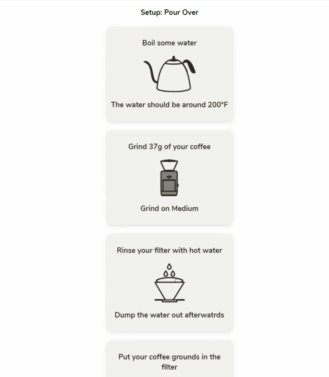
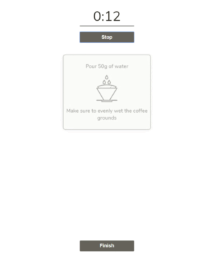
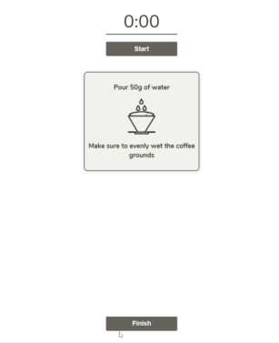
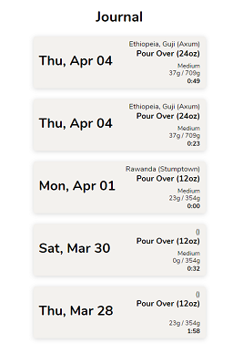

# Coffee Companion

A home coffee brewing application built with React and Node.js. Guides users through the brewing process and without needing to understand the science behind coffee.

## Guest Account
You can login to test the live application with these credentials

Email : __test@guest.com__

Password : __12345678__

-------------

## What I Learned

* Styled Components
* Authentication with JWT
* Higher Order Components
* Working with a React Frontend and Node backend together.
* Using a design tool like Figma to create SVG icons

---------------------------------------
### __Asking the user how they'd like their coffee__

When you sign in the first screen will ask you several questions:
* What coffee are you brewing
* What Brew Method you are using __(after selecting the app will recommend a grind size and select one for you)__
* How much coffee you'd like to drink
* How strong do you like your coffee
* What grindsize you'd like

### __Setting up the brew__

After taking in the users information the app will dynamically generate steps to set up the selected brew method based on the parameters given.

### __Brewing the coffee__

When the user is ready to brew they will be given one step at a time, when the step is about to finish it will flash, indicating that it will be changing soon. This is all based on he overall brew time.

The user can scroll through all of the steps at any point during the brew and the app will not lose track of where they're at. This is a custom built carousel using styled-components.

### __Viewing past brews__

After clicking finsh on your brew you will be redirected to your journal. Here you can view all of your past brews with all of the parameters you selected. This is so that you can easily replicate a particular cup of coffee you enjoyed.

